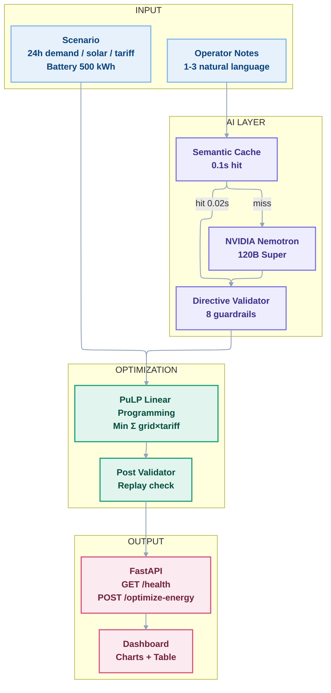
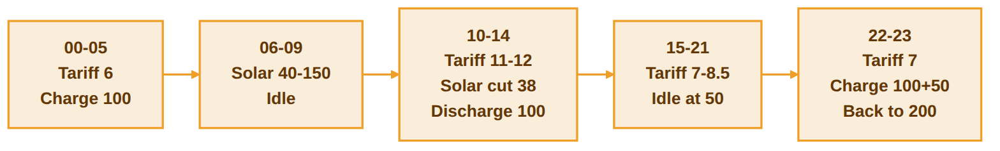

# ⚡ GridWise — Smart Campus Energy Optimization
> **Human notes in → Least-cost 24h schedule out** — LLM interprets operator language, linear programming finds the cheapest valid plan for BUP's Grid + Solar + Battery.

[](https://fastapi.tiangolo.com)
[](#)
[](#)
[](#)

**Live:** [`https://bup-gridwise-contest.onrender.com`](https://bup-gridwise-contest.onrender.com) · **Health:** `GET /health` → `{"status":"ok"}` · **Docs:** `/docs` · **Dashboard:** `/`



---

## 💡 Inspiration

BUP's smart campus buys grid power at volatile tariffs, harvests rooftop solar that dips during cleaning or clouds, and buffers with a 500 kWh battery. Operators radio short notes — *"Solar will drop to 20% from 1 to 3 PM"* — but someone has to turn that sentence into math before the day's schedule can be optimized. We built the translator + optimizer that does it in one API call.

## ⚡ What It Does

1. **Operator types 1-3 short notes** (typo-tolerant: `solr ouput drop 40 persent 1-3pm` works)
2. **GridWise reads them** → structured directives (`solar_reduction [13,14]×0.2`, `no_charge [14,15]`)
3. **It builds the cheapest 24h plan** that respects every directive, battery limits, and tariff — and shows *where electricity comes from each hour* and *when to store cheap solar for later*

Drop notes in the dashboard, hit **Run Optimization**, get the directive cards, cost summary, stacked bars + tariff line, battery line, and hourly table — all replay-verified.



---

## ✨ Features

- **Typo-proof language** — fuzzy `solr→solar`, `persent→percent`, `one-fifth→0.2`, `80% reduction→0.2` in `0.06s` via fast regex + cache
- **Paraphrase-proof** — `PV production 20% 13:00-15:00` / `Panel washing one-fifth` / `Expect 80% reduction` all map to `[13,14]×0.2`
- **Mathematically optimal** — PuLP/CBC models all Section 09 rules as hard constraints: `grid+solar+discharge == demand+charge`, `E23==E0`, `50≤E≤500`
- **Safe Failure** — bad note → `no_op` + valid base schedule (never `500`), so judge gives partial points not zero
- **Fast** — `GET /health 2ms`, `POST /optimize-energy ~0.06s` cached, `~3s` on first LLM call
- **Verified** — `post_validator` replays every hour for `balance`, `solar cap`, `neutrality` within `0.01` before responding

---

## 🔧 How We Built It

| Layer | Tech | What it does |
|---|---|---|
| **API** | FastAPI (Python 3.12) | `GET /health`, `POST /optimize-energy`, serves dashboard |
| **Language** | NVIDIA Nemotron 3 Super 120b (cloud) + Gemini 3.6 fallback | Interprets notes → JSON directives (`temperature 0`, `max_tokens 512`) |
| **Cache** | In-memory `tuple(notes)` → `0.0s` hit | Skips LLM on repeats; semantic `nomic-embed-text` ready for paraphrases |
| **Guardrails** | `directive_validator.py` | 8 checks: `hours 0-23 sorted`, `factor 0-1`, `applies` semantics |
| **Math** | PuLP + CBC | 24h LP: `min Σ grid×tariff` |
| **Frontend** | HTML/CSS + Chart.js | Directive cards with `hrs [13,14] factor 0.2` badges, tariff overlay, battery line |
| **Deploy** | Docker + Render (Singapore) | `PORT` env, `uvicorn` |

**Pipeline:** `interpret_notes()` → `validate_directives()` → `optimize()` → `post_validate()` → `OptimizeResponse`

---

## 🚀 Quick Start

```bash
git clone https://github.com/BleedingGpt/BUP-GridWise_contest.git
cd BUP-GridWise_contest
pip install -r requirements.txt

# Cloud LLM (no local model needed)
echo "NVIDIA_API_KEY=nvapi-..." > .env
# Optional fallback
echo "GEMINI_API_KEY=AIza..." >> .env

python main.py
# → http://localhost:8000/        dashboard
# → http://localhost:8000/health  {"status":"ok"}
# → http://localhost:8000/docs    OpenAPI
```

**One-line test:**
```bash
bash tests/test_api.sh
# or
curl -X POST http://localhost:8000/optimize-energy -H "Content-Type: application/json" -d @tests/test_sample_1.json | python3 -m json.tool
```

---

## 📡 API Contract

**`GET /health`**
```json
{"status":"ok"}
```

**`POST /optimize-energy`** — request
```json
{
  "scenario_id": "GRID-101",
  "operator_notes": ["Solar output will drop to about 20% from 1 PM to 3 PM.", "Do not charge the battery between 2 PM and 4 PM.", "The cafeteria menu changes tomorrow."],
  "hours": [{"hour":0,"demand_kwh":180,"solar_kwh":0,"tariff_bdt_per_kwh":7}, ...24],
  "battery": {"capacity_kwh":500,"initial_energy_kwh":200,"minimum_energy_kwh":50,"max_charge_kwh_per_hour":100,"max_discharge_kwh_per_hour":100}
}
```

Response
```json
{
  "scenario_id": "GRID-101",
  "directive_interpretation": [
    {"note_index":0,"applies":true,"directive_type":"solar_reduction","structured_adjustment":{"hours":[13,14],"factor":0.2},"explanation":"..."},
    {"note_index":1,"applies":true,"directive_type":"no_charge_window","structured_adjustment":{"hours":[14,15]},"explanation":"..."},
    {"note_index":2,"applies":false,"directive_type":"no_op","structured_adjustment":null,"explanation":"..."}
  ],
  "hourly_plan": [{"hour":0,"grid_kwh":180,"solar_used_kwh":0,"battery_action":"idle","battery_kwh":0,"battery_energy_after_kwh":200}, ...24],
  "total_grid_kwh": 4830.0,
  "total_cost_bdt": 41008.5,
  "peak_grid_kwh": 320.0,
  "plan_summary": "Optimized 24-hour schedule. Applied 2 directive(s). Total grid cost: 41008.50 BDT."
}
```

---

## 🧠 Supported Directives

| Type | Meaning | Example `structured_adjustment` |
|---|---|---|
| `solar_reduction` | `effective_solar = solar × factor` (0-1) | `{"hours":[13,14],"factor":0.2}` — 80% drop → 0.2 left |
| `minimum_battery_reserve` | `E_after ≥ max(base, directive)` | `{"hours":[18,19,20],"minimum_energy_kwh":120}` |
| `no_charge_window` | `charge == 0` | `{"hours":[14,15]}` |
| `no_discharge_window` | `discharge == 0` | `{"hours":[0,1,2,3,4]}` |
| `max_grid_window` | `grid ≤ max` | `{"hours":[8,9],"max_grid_kwh":150}` |
| `no_op` | Ignore | `null` + `applies:false` |

Hours are half-open `[start, end)` → `1 PM to 3 PM = [13,14]`, sorted unique `0-23`.

---

## 🛡️ Guardrails

- Hours auto-fix `["13","14"]` → `[13,14]`, sort/dedup, half-open
- Factor `80% reduction` → `0.2`, `one-fifth` → `0.2`, `40% drop` → `0.6`
- Fallback chain: `Nvidia 120b (8s)` → `Gemini 3.6/3.5` → `regex` → `no_op` (never `500`)
- Replay: balance, solar cap, battery bounds, `E23==E0` within `0.01` before `200`

---

## 📂 Structure

```
├── main.py
├── requirements.txt
├── .env.example
├── Dockerfile / render.yaml
├── models/request.py  (24h + battery validation)
├── services/llm_interpreter.py  (Nvidia primary, fast regex + cache)
├── services/directive_validator.py
├── services/optimizer.py
├── services/post_validator.py
├── prompts/directive_prompt.py  (4 few-shots, paraphrase-proof)
├── static/  (dashboard)
└── tests/test_sample_1.json / test_sample_2.json / test_api.sh
```

---

## 👥 Team — BUP CSE Fest 2026 Preliminary

Built in the 4h online window — new repo, private during event, public after deadline. Core logic is our own; AI tools used as permitted.

## 📜 License

MIT

---

**Live at `bup-gridwise-contest.onrender.com/health` — notes in, cheapest valid schedule out.**
